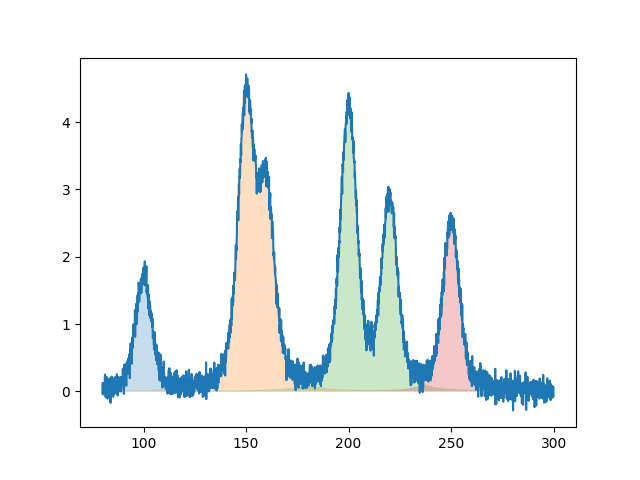
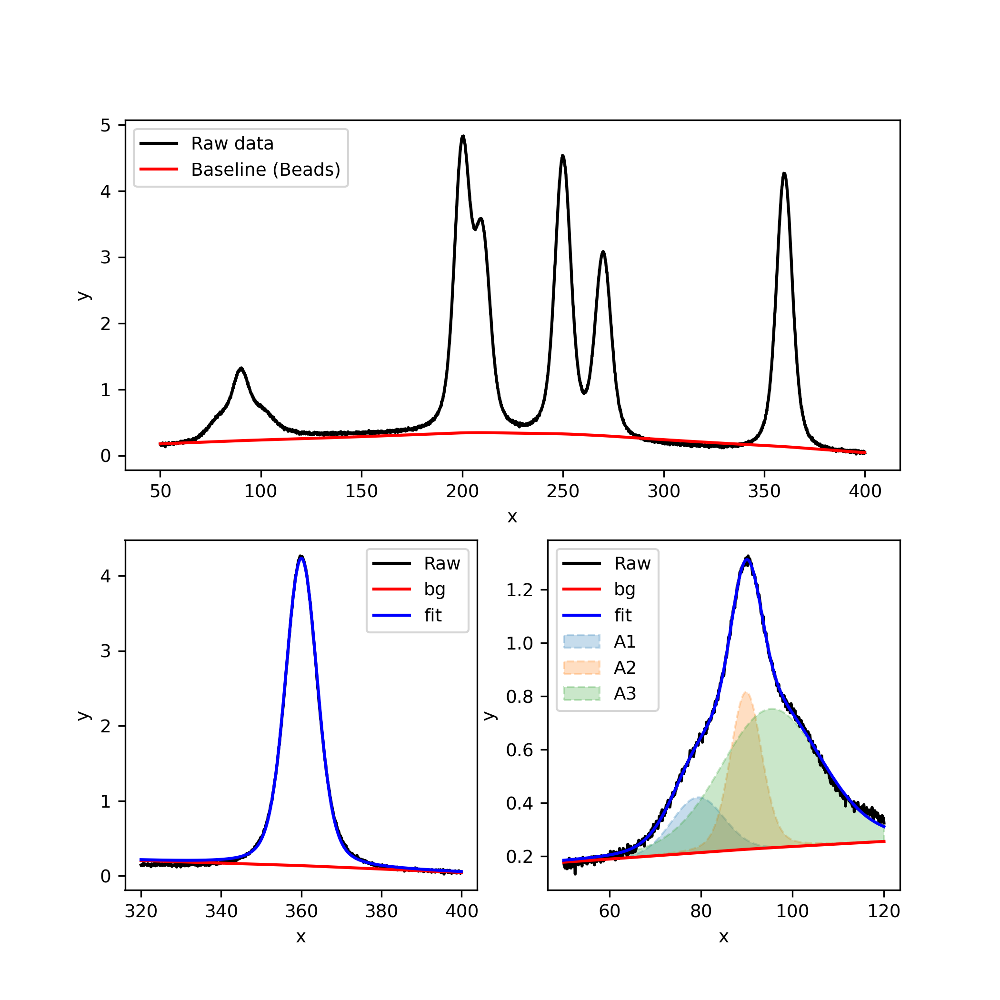

# pyspecfit

> A lightweight Python package for reproducible peak fitting of spectroscopic data.

`pyspecfit` is a Python package for analyzing spectroscopic data such as X-ray Photoelectron Spectroscopy (XPS) and Raman spectroscopy. It provides a reproducible, object-oriented workflow for spectrum handling, background registration, peak fitting, visualization, and result export.

Unlike many peak fitting scripts, **background estimation is intentionally decoupled from the fitting engine**, allowing users to integrate any baseline estimation algorithm while keeping the fitting workflow unchanged.

<p align="center">

</p>

---

# Features

- 📈 Voigt singlet and doublet peak models
- 📊 Constrained nonlinear least-squares fitting
- 🧩 Flexible background registration from external algorithms
- 📁 CSV-based fitting parameter management
- 🎨 Automatic peak decomposition and visualization
- 💾 Export of fitted spectra and optimized parameters
- 🐍 Simple, object-oriented Python API

---

# Installation

Clone the repository and install it in editable mode.

```bash
git clone https://github.com/aacco/pyspecfit.git
cd pyspecfit
pip install -e .
```

## Requirements

Core dependencies

- numpy
- scipy
- pandas
- matplotlib

Optional

- pybaselines (recommended for baseline estimation)

---

# Quick Start

Example scripts are available in

```text
example/simple/
```

The example demonstrates

- loading spectral data,
- creating a `Spectrum`,
- estimating backgrounds using `pybaselines`,
- performing peak fitting,
- plotting results,
- exporting fitted spectra.

## Fitting

```python
import pandas as pd
import matplotlib.pyplot as plt
import pybaselines
import pyspecfit as psf

# Load spectrum
df_raw = pd.read_csv("sampledata/sampledata.csv")
df_fitparam = pd.read_csv("fitparam.csv")

# Create Spectrum object
sp = psf.Spectrum(
    xy=df_raw,
    fitparam=df_fitparam,
)

# Estimate background
baseline = pybaselines.Baseline(
    x_data=sp.data.x
)

bg, _ = baseline.beads(
    sp.data.y_raw,
    freq_cutoff=1e-4,
)

sp.register_new_bg(
    bg,
    "pybaselines_beads",
)

# Peak fitting
sp.fit()

# Print optimized parameters
sp.print_resultparam()

# Plot results
fig, ax = plt.subplots()

ax.plot(sp.data.x, sp.data.y_raw, label="Raw")
ax.plot(sp.data.x, sp.data.y_bg, label="Background")
ax.plot(sp.data.x, sp.data.y_fit, label="Fit")

for name, peak in sp.data.y_eles.items():
    ax.fill_between(
        sp.data.x,
        peak + sp.data.y_bg,
        sp.data.y_bg,
        alpha=0.3,
        label=name,
    )

ax.legend()

plt.show()
```

## Saving and Loading Results

The complete processed spectrum can be saved as a CSV file.

```python
sp.save_data("xy.csv")

sp.resultparam.to_csv(
    "resultparam.csv",
    index=False,
)
```

The saved spectrum can later be restored as a new `Spectrum` object.

```python
import pyspecfit as psf

sp = psf.Spectrum.load_csv("xy.csv")
```

The loaded object provides the same data interface as a newly fitted spectrum.

```python
print(sp.data.xy_all)

fig, ax = plt.subplots()

ax.plot(sp.data.x, sp.data.y_raw, label="Raw")
ax.plot(sp.data.x, sp.data.y_bg, label="Background")
ax.plot(sp.data.x, sp.data.y_fit, label="Fit")

for name, peak in sp.data.y_eles.items():
    ax.fill_between(
        sp.data.x,
        peak,
        alpha=0.3,
        label=name,
    )

ax.legend()
plt.show()
```

---

# Workflow

The typical workflow consists of four steps.

```text
Raw spectrum
      │
      ▼
Create Spectrum
      │
      ▼
Register background
      │
      ▼
Peak fitting
      │
      ▼
Visualization / Export
```

---

# Core Concepts

## Spectrum

`Spectrum` represents **an entire spectrum analysis session**.

It manages

- spectral data
- fitting parameters
- registered backgrounds
- optimization
- fitting results

A single `Spectrum` object contains everything required to reproduce an analysis.

```python
sp.fit()
```

updates

- optimized parameters
- fitted spectrum
- individual peak components
- fitting statistics

without requiring users to manually synchronize intermediate results.

---

## xySeries

Numerical data are stored in the `xySeries` object (`Spectrum.data`).

Rather than storing each array separately, `xySeries` organizes the complete analysis into a single MultiIndex `pandas.DataFrame`.

Conceptually,

```text
base
 ├── x
 ├── y_raw
 ├── y_bg
 └── y_fit

bg
 ├── pybaselines_beads
 └── ...

peak
 ├── Peak1
 ├── Peak2
 └── ...
```

This structure makes it straightforward to

- export the complete analysis,
- compare multiple backgrounds,
- visualize peak components,
- automate post-processing.

---

# Background Registration

`pyspecfit` intentionally **does not implement a dedicated baseline estimation algorithm**.

Instead, backgrounds generated by external packages can be registered through

```python
sp.register_new_bg(
    background,
    "background_name",
)
```

This allows seamless integration with

- pybaselines
- custom algorithms
- laboratory-specific workflows

without modifying the fitting engine.

---

# Accessing Results

Processed spectra are available through `Spectrum.data`.

| Property | Description |
|----------|-------------|
| `data.x` | x-axis |
| `data.y_raw` | Raw spectrum |
| `data.y_bg` | Total background |
| `data.y_fit` | Fitted spectrum |
| `data.y_eles` | Individual peak components |
| `data.xy_all` | Complete processed dataset |

Optimized fitting parameters are available through

```python
sp.resultparam
```

---

# Saving Results

```python
sp.data.xy_all.to_csv(
    "xy.csv",
    index=False,
)

sp.resultparam.to_csv(
    "resultparam.csv",
    index=False,
)
```

---

## Pipeline Example

`pyspecfit` is designed to support complete spectral analysis workflows, from preprocessing to peak fitting. Individual processing steps can be combined into a concise and reproducible pipeline.

### Workflow

```text
Raw spectrum
      │
      ▼
Baseline estimation (BEADS)
      │
      ▼
Reference peak fitting
      │
      ▼
Wavenumber calibration
      │
      ▼
Target peak fitting
      │
      ▼
Peak parameters
```

### Example

```python
import pandas as pd
import pybaselines
import pyspecfit as psf

# Load spectrum
df = pd.read_csv("sampledata.csv")
spec = psf.Spectrum(xy=df)

# Baseline estimation
baseline, _ = pybaselines.Baseline(
    x_data=spec.data.x
).beads(spec.data.y_raw)

spec.register_new_bg(baseline, "BEADS")

# Fit reference peak
spec_ref = spec.xclip(
    clip_range=(320, 400),
    newfitparam=pd.read_csv("pipeline_fitparam_1.csv"),
)

spec_ref.fit()

# Correct the x-axis using the fitted reference peak
spec.xshift(360 - spec_ref.resultparam.position.iloc[0])

# Fit the target spectral region
spec_target = spec.xclip(
    clip_range=(50, 120),
    newfitparam=pd.read_csv("pipeline_fitparam_2.csv"),
)

spec_target.fit()
```

### Result

The following figure illustrates each step of the pipeline.

<p align="center">

</p>

From left to right:

1. Baseline estimation using the BEADS algorithm.
2. Fitting of the reference peak for calibration.
3. Peak fitting of the target region after spectral alignment.

This pipeline demonstrates how preprocessing, calibration, and fitting can be seamlessly integrated while keeping the analysis workflow concise and reproducible.

# Documentation

More detailed documentation is available in the `docs` directory.

- **Design** (`docs/design.md`)
  - Class architecture
  - Design philosophy
  - Workflow

- **API Reference** (`docs/api.md`)
  - `Spectrum`
  - `xySeries`
  - Public methods

- **Background Estimation** (`docs/background.md`)
  - Background registration
  - Recommended workflows
  - Integration examples

- **Fitting Parameters** (`docs/fitparam.md`)
  - CSV format
  - Peak models
  - Parameter constraints

---

# License

This project is distributed under the MIT License.
